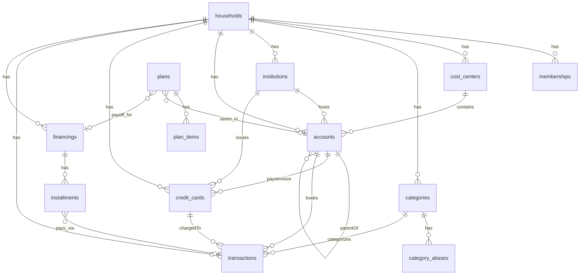

# Modelo de dados

Schema Drizzle em `/home/flaesh/time-is-money/packages/db/src/schema/index.ts`. PostgreSQL no Neon.

## Entidades centrais

### households

Grupo financeiro (família). Opcionalmente ligado a `clerk_org_id`.

### memberships

Vínculo usuário ↔ household. Campos: `user_id` (Clerk), `email`, `role` (`admin` | `editor` | `viewer`).

### cost_centers

Centros de custo (ex.: Pessoa Física, Empresa). `is_system`, `is_archived`.

### categories

Categorias hierárquicas (`parent_id`). Tipo: `income` | `expense`. Aliases em `category_aliases`.

### institutions

Bancos/instituições financeiras por household (ex.: Nubank, Itaú).

### accounts

Contas ativas vinculadas a um `cost_center_id` e opcionalmente a `institution_id`.

| Campo                      | Notas                                                 |
| -------------------------- | ----------------------------------------------------- |
| `kind`                     | `cash` \| `checking` \| `savings` \| `investment_pot` |
| `parent_account_id`        | Caixinha “dentro de” outra conta (FK self)            |
| `balance_cents`            | Snapshot manual (+ transfers / pagamento de fatura)   |
| `yield_type` / `yield_bps` | Rendimento estimado (CDI ou taxa fixa)                |

### credit_cards

Cartões (passivo) por banco. Ver ADR [`0011-payment-methods-invoice-cycle.md`](../adr/0011-payment-methods-invoice-cycle.md).

| Campo                     | Notas                         |
| ------------------------- | ----------------------------- |
| `institution_id`          | Banco emissor                 |
| `payment_account_id`      | Conta que paga a fatura       |
| `card_mode`               | `credit` \| `debit` \| `both` |
| `credit_limit_cents`      | Limite                        |
| `invoice_balance_cents`   | Cache do saldo aberto         |
| `closing_day` / `due_day` | 1–28 (ciclo)                  |

### credit_card_invoices

Ciclos de fatura (`open` \| `closed` \| `paid`). Unique `(credit_card_id, closes_on)`.

### account_transfers

Transferências internas entre contas (não são receita/despesa).

### transactions

Lançamentos financeiros.

| Campo                    | Tipo        | Notas                                          |
| ------------------------ | ----------- | ---------------------------------------------- |
| `amount_cents`           | integer     | Valores em centavos                            |
| `occurred_on`            | varchar(10) | ISO date `YYYY-MM-DD`                          |
| `credit_card_id`         | uuid?       | Despesa no cartão → aumenta fatura             |
| `credit_card_invoice_id` | uuid?       | Ciclo de fatura da compra                      |
| `payment_rail`           | varchar?    | `pix` \| `debit` \| `ted` \| `cash` \| `other` |
| `notes_encrypted`        | text        | AES-256-GCM                                    |
| `source`                 | varchar     | `manual`, `import`, `jarvis`, `financing`      |
| `duplicate_hash`         | varchar(64) | Dedup na importação                            |
| `deleted_at`             | timestamp   | Soft delete                                    |

Ver ADR [`0009-banks-accounts-cards.md`](../adr/0009-banks-accounts-cards.md).

### financings + installments

Financiamentos com cronograma de parcelas.

- `installment_status`: `pending` | `paid` | `skipped`
- `financing_category`: `real_estate` | `vehicle` | `personal` | `other`
- Parcela paga gera `transaction` e referencia `transaction_id`

### plans + plan_items

Metas de planejamento (viagens, quitação, amortização imobiliária, custom).

- `plan_kind`: `travel` | `financing_payoff` | `real_estate_amortization` | `custom`
- Meta total = soma de `plan_items.amount_cents`
- `linked_account_id` → caixinha (`investment_pot`) para progresso
- `financing_id` opcional (obrigatório em `financing_payoff` e `real_estate_amortization`; neste último o financiamento deve ser `category = real_estate`)
- `monthly_target_cents` — aporte mensal da estratégia
- `plan_contributions` — cronograma mensal (`due_on`, `amount_cents`, `sort_order`)

Ver [`docs/domain/planning.md`](../domain/planning.md).

## Jarvis

- `jarvis_threads` — conversas por usuário/household
- `jarvis_messages` — mensagens com `intent` JSONB

## Import/Export

- `import_jobs` + `import_job_rows` — pipeline com preview
- `export_jobs` — auditoria de exportações

## Preferências e notificações

- `user_preferences` — defaults, janelas de lembrete, TTS
- `notification_outbox` — dedup de emails enviados (unique por user/kind/ref/window/sent_on)

## Audit

- `audit_logs` — ações com `resource_type`, `metadata` JSONB

## Enums

```
member_role: admin | editor | viewer
transaction_type: income | expense
account_kind: cash | checking | savings | investment_pot
yield_type: none | cdi | fixed_annual
installment_status: pending | paid | skipped
import_status: pending | preview | processing | completed | failed
message_role: user | assistant | system
message_source: text | voice
```

## Regra de ouro

**Toda tabela de negócio tem `household_id`.** Queries sem esse filtro são bug de segurança.

## Diagrama ER (simplificado)



## Migrations

```bash
pnpm db:generate   # após alterar schema
pnpm db:migrate    # aplicar
```

Config Drizzle: `packages/db/drizzle.config.ts`.
